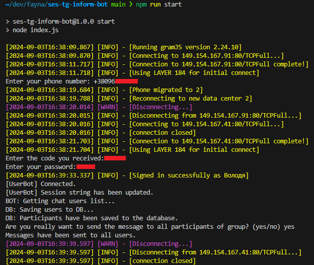

# Fayna checker

## Setup

Для початку роботи необхідно:

1. Зклонувати репозиторій
2. Запустити команду `npm run setup`
3. Запустити утиліту `npm run start` або `node index.js`

Команда `npm run setup` створює додаткові файли, які необхідно буде налаштувати перед запуском утиліти:

- `message.txt` - Повідомлення яке буде розсилатись користувачам
- `.env` - Змінні оточення, з яких береться конфігурація

При першому запуску утиліти буде створено додатковий файл `.tg-session` - у ньому зберігається Telegram-сесія у строковому вигляді.

Процес експлуатації:

1. Якщо це перший запуск утиліти, то буде запропоновано авторизуватись.
2. Після авторизації будуть отримані та збережені до бази users.db (sqlite3) усі учасники групи.
3. Далі буде запропоновано розіслати повідомлення усім користувачам.
4. Якщо відповісти yes - почнеться розсилка повідомлення з message.txt

Деталі на скріншоті:
 

## Rationale

Треба зробити розсилку по всіх учасниках Закритого чату ЖК Файна Таун з приводу платежу на користь Файна СЕС. Є розуміння, що багато людей просто не в процесі і
не знають що потрібно закинути грошей.

## Завдання

Є Telegram аккаунт @FaynaChecker, який має в контактах всіх учасників Закритого чату. Треба написати mtproto бота (не звичайного бота!!!). Бот має авторизуватись з заданим
номером телефона, запитати код, запитати пароль. Після цього він має отримати список учасників Закритої групи. Кожному учаснику бот надсилає задане коротке повідомлення
і записує в будь яке локальне сховище ID користувача після успішної відправки. Перед тим як відправити, бот перевіряє чи немає користувача вже в цьому сховищі, щоб не
відправити повідомлення двічі, якщо бот впав і перезавантажився. Бот має надсилати повідомлення з певною затримкою, щоб не натрапити на rate limit.

Мова розробки значення немає. Зазвичай, існують бібліотеки, які все це реалізують на високому рівні (наприклад, для node.js mtcute, tgsnake).
Тестуєте на своєму особистому акаунті, розробник доступ до Fayna Checker мати не буде. Після review бот запуститься з кредами @FaynaChecker.

## Дедлайн

До кінця дня 4 вересня, щоб на наступний день вже можна було запустити розсилку.
